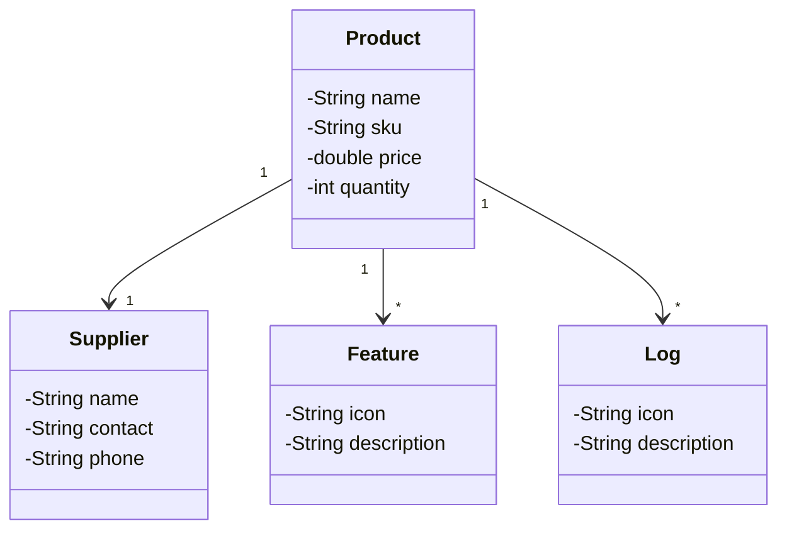

# Desafio API Rest do programa DIO Avanade 2025

Para o desafio, foi pensado uma API de controle de estoque

## Diagrama de classes

```mermaid 
classDiagram
    class Product {
        -String name
        -String sku
        -double price
        -int quantity
    }
    
    class Supplier {
        -String name
        -String contact
        -String phone
    }
    
    class Feature {
        -String icon
        -String description
    }
    
    class Log {
        -String icon
        -String description
    }

    Product "1" --> "1" Supplier
    Product "1" --> "*" Feature
    Product "1" --> "*" Log
```
