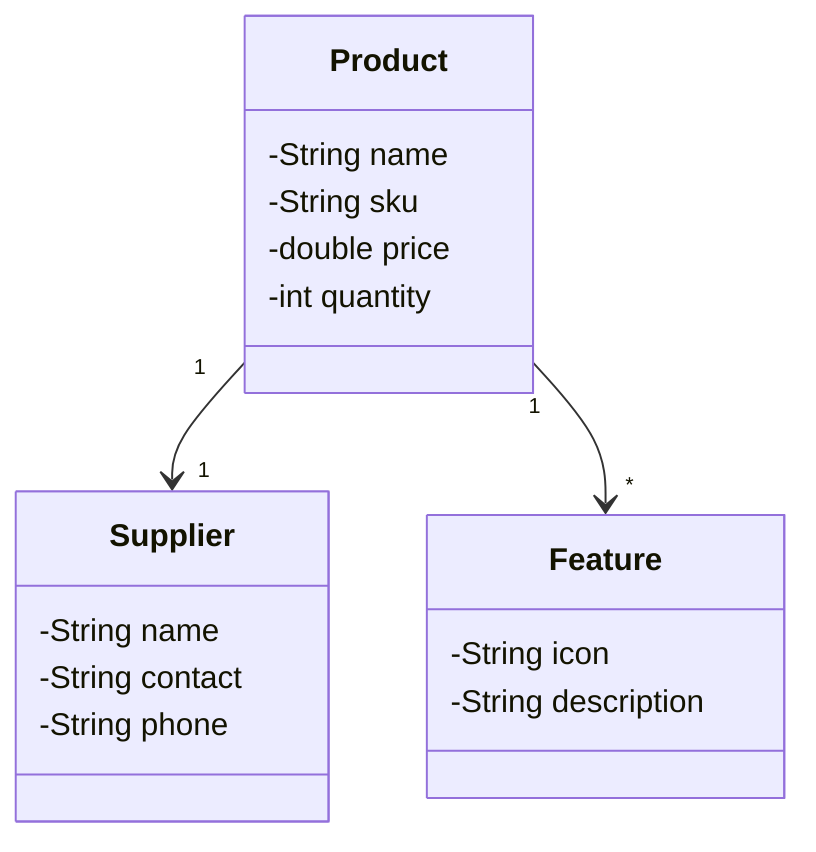

# Desafio API Rest do programa DIO Avanade 2025

Este projeto faz parte do desafio da DIO Avanade 2025 e, basicamente, consiste no desenvolvimento de uma API REST para o gerenciamento de estoque de uma loja. 

## Diagrama de classes

